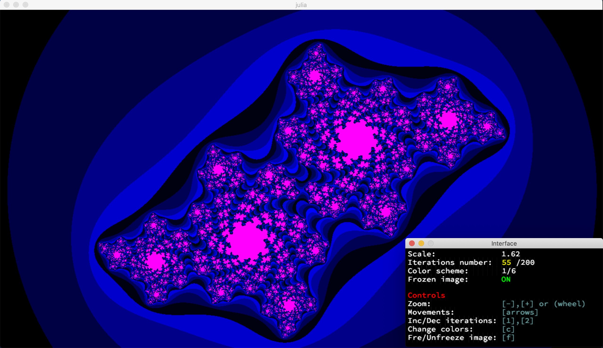
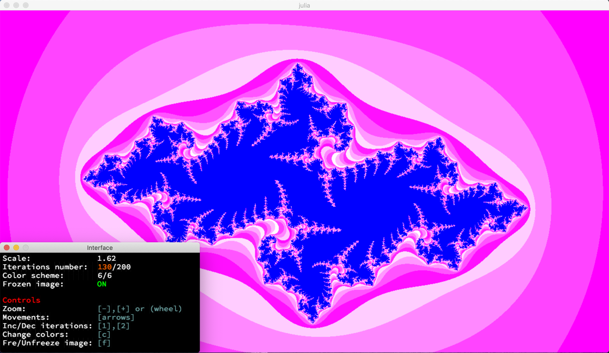
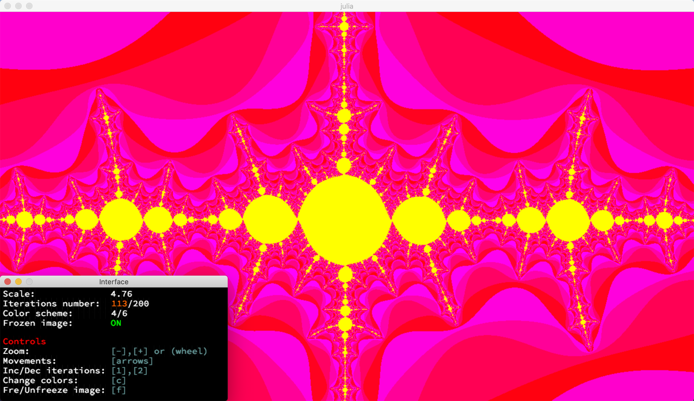
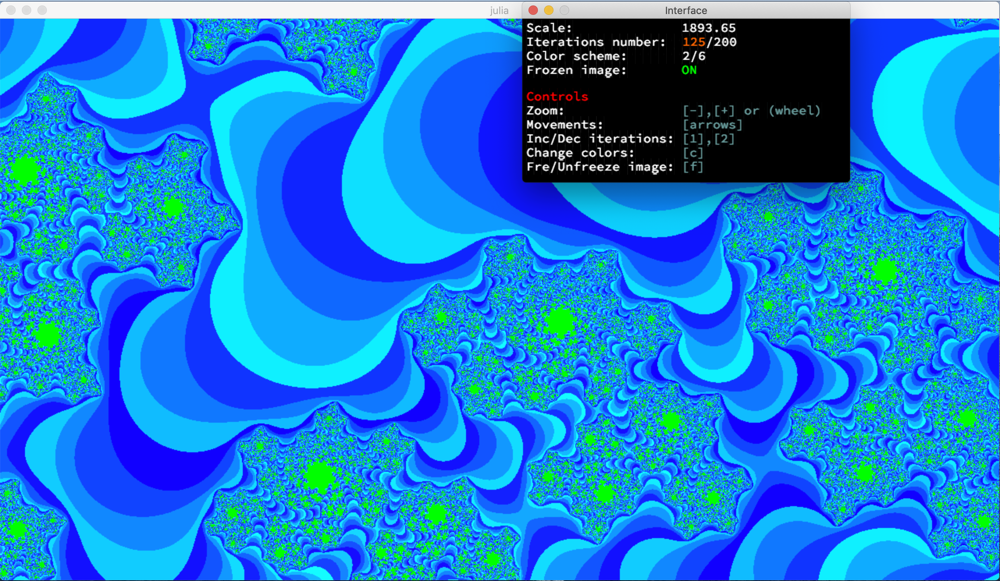
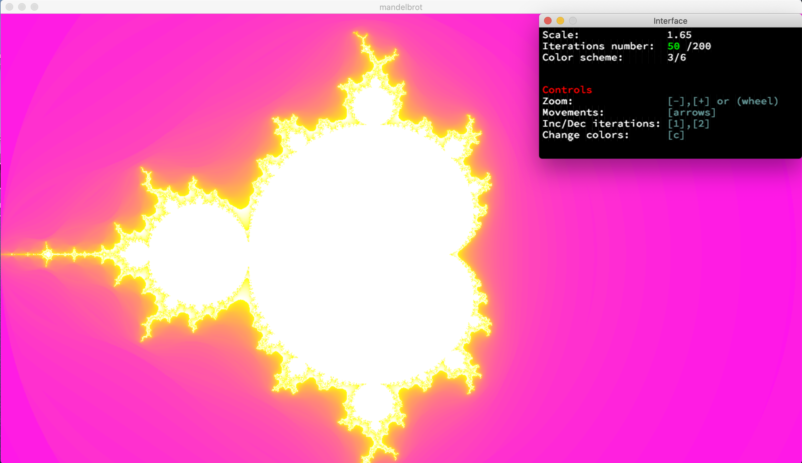
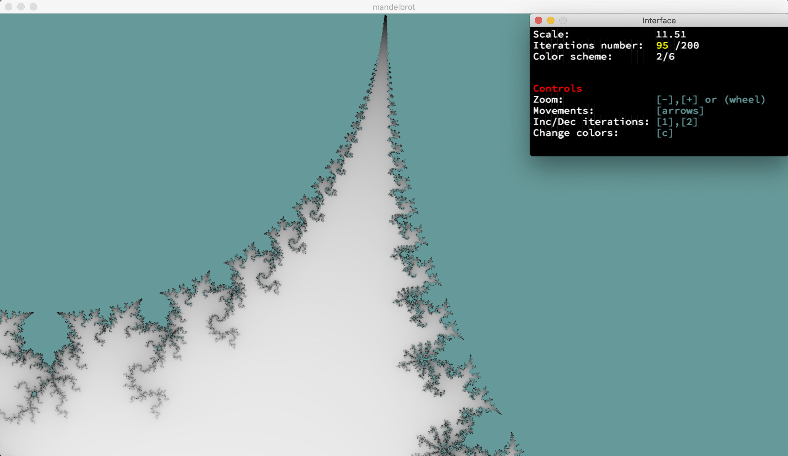
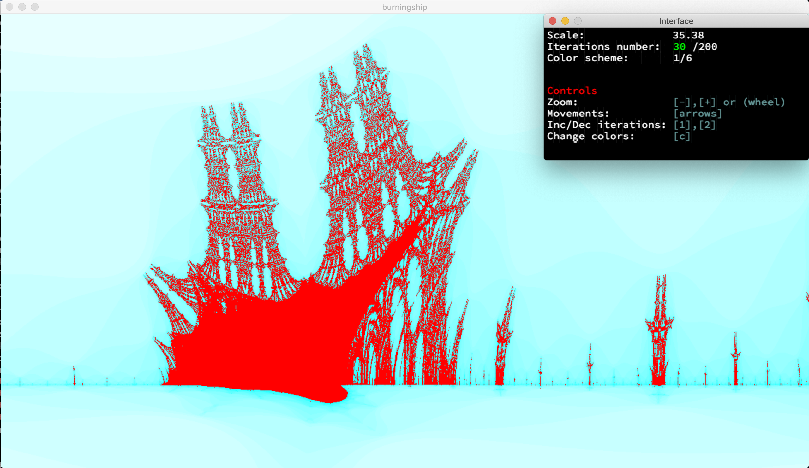
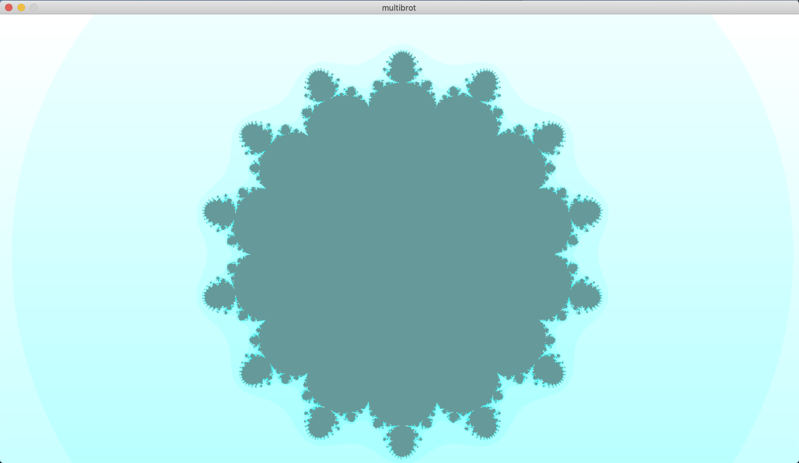
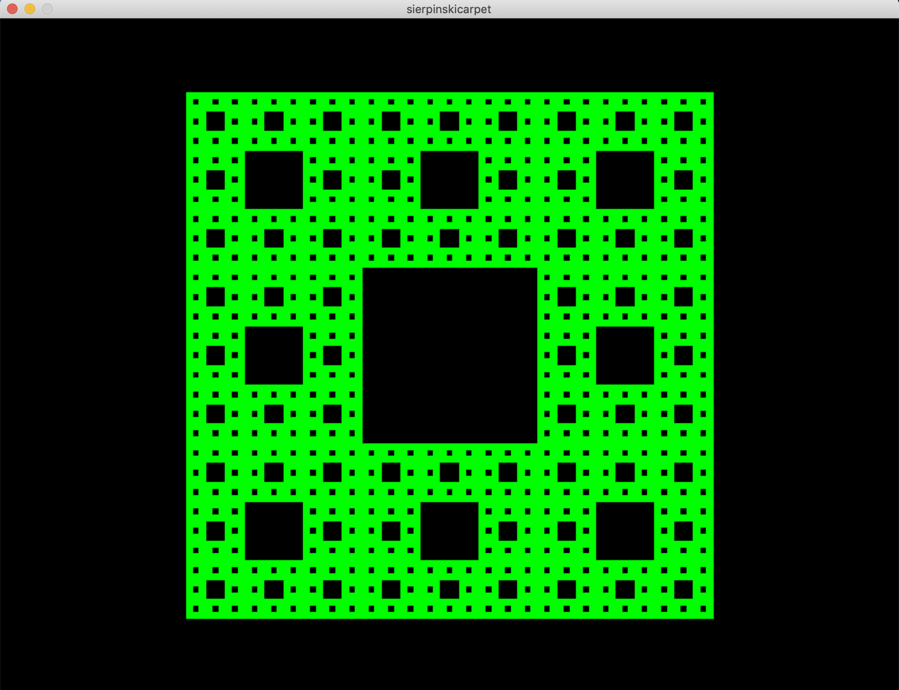
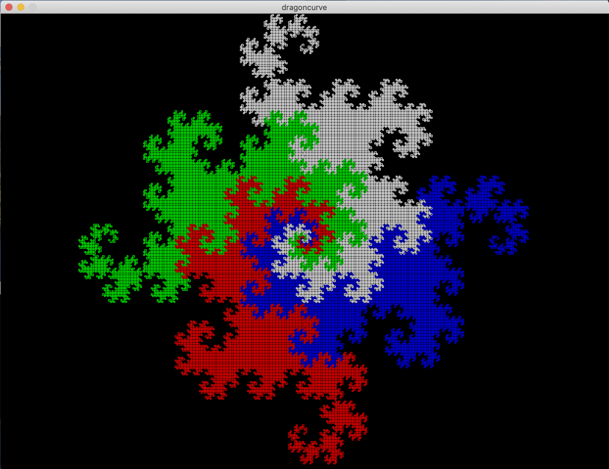

FRACTOL

This project’s goal is to create a small fractal exploration program.
This project allows to discover/use the mathematical notion of complex numbers and to take a peek at the concept of
optimization in computer graphics.

__NOTE:__
The whole project was realized using the school's graphic library: MinilibX.
This library contains only basic drawing functions: open a window, lit a pixel and manage events.
Everything else must be coded by students. (ex. multithreading, zoom, pixel coloring...).

Mandatory functions:
- It must be possible to change the parameters of the Julia set only with the mouse movement.
- The mouse wheel zooms in and out, almost infinite.

Bonus functions:
- More that 3 fractals
- The zoom follow the actual mouse position
- Make the color range shift
- Separate windows with fractal information
- Multi-threading implementation (realized with the C library pthread.h)

_If you are interested to the complete code, please do not hesitate to contact me._
